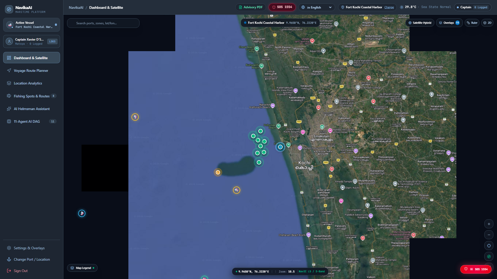
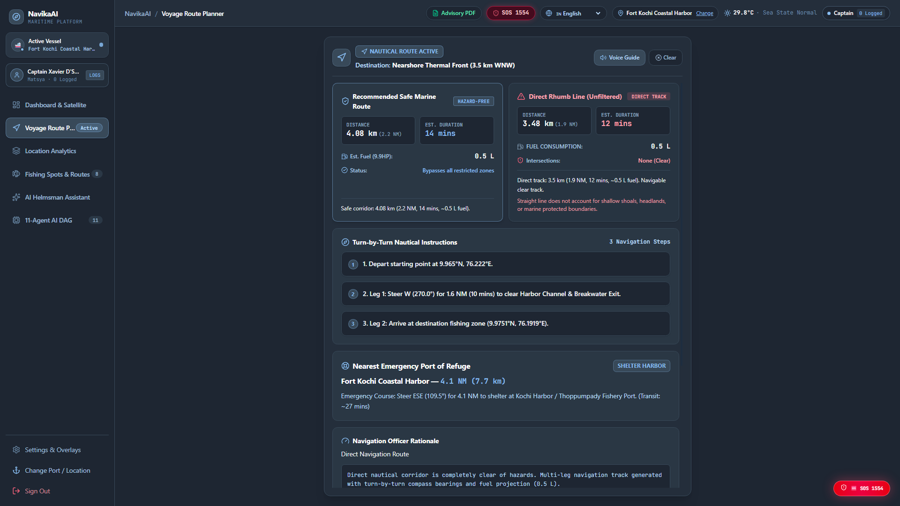
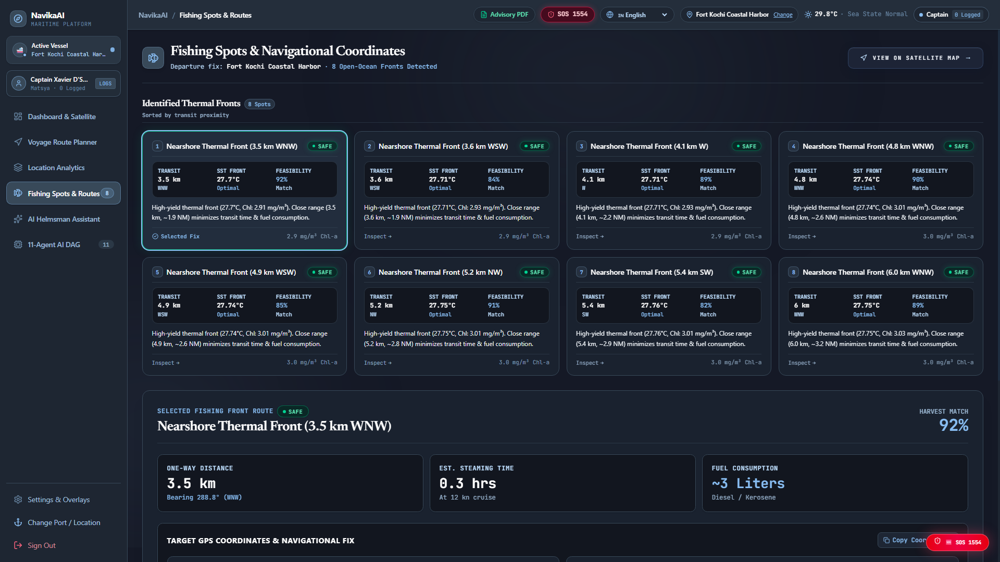
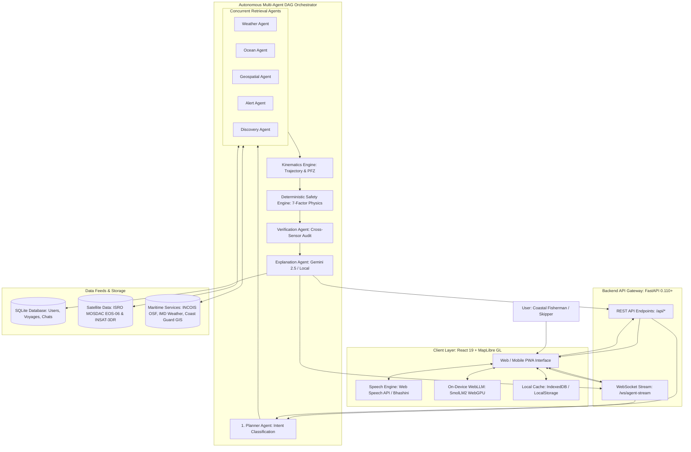

# Navika AI

Autonomous Multi-Agent Marine Intelligence and Navigational Safety Platform for Coastal Fishermen.

**Smart India Hackathon (SIH 2026) · Problem Statement SIH26176 / PS-26176 · Indian Space Research Organisation (ISRO)**

[](https://mosdac.gov.in)
[](https://samudra-ai-xkdf.vercel.app/)
[](https://fastapi.tiangolo.com)
[](https://react.dev)
[](https://maplibre.org)
[](https://python.org)
[](./LICENSE)

---

## 👥 Team

| Member | Role | Domain & Focus Area |
|---|---|---|
| **Aayush Saroha** | AI Agent Engineer | Multi-Agent Orchestration, Task DAG & Verification Guardrails |
| **Aditya Pareek** | Data Engineer | ISRO MOSDAC (EOS-06 / INSAT-3DR) Ingestion & Scientific NetCDF4/HDF5 Processing |
| **Arjun Shandilya** | ML Engineer | Edge AI Inference, WebLLM / SmolLM2 WebGPU Integration & Kinematic Modeling |
| **Arkin Raj** | GeoSpatial Engineer | GIS Geofencing (IMBL / MPAs), Bathymetry & MapLibre Vector Overlays |
| **Aryan Dhiman** | Domain & Prompt Engineer | Maritime Domain Logic, Vernacular Prompting & Multilingual Bhashini Voice Pipeline |
| **Kirti Sakuja** | Integration Lead | Full-Stack Systems Architecture, WebSocket Streaming & End-to-End Evaluation |

---

## ⚡ Quick Demo & Live Evaluation

> **🌐 Live Production Deployment:** **[https://samudra-ai-xkdf.vercel.app/](https://samudra-ai-xkdf.vercel.app/)**  
> **📖 Step-by-Step Evaluation Walkthrough:** See **[DEMO.md](DEMO.md)** for testing the 8 official ISRO evaluation scenarios locally or on the live web instance.

### 8 Ready-to-Test Evaluation Scenarios (from [DEMO.md](DEMO.md))
1. **PFZ Discovery**: *"Where is the nearest PFZ?"* - Ranks oceanographic fishing spots by distance, bearing, and chlorophyll density.
2. **24-Hour Safety Verdict**: *"Is it safe to go fishing tomorrow morning?"* - Evaluates wave swell and wind vectors against the Douglas Sea Scale.
3. **Hydrodynamic Telemetry**: *"What are the wave and wind conditions?"* - Reports Beaufort wind scale, sea surface temperature, and swell periods.
4. **Oceansat-3 Biogeochemistry**: *"Show areas with high chlorophyll and favourable SST"* - Identifies thermal convergence fronts for pelagic shoals.
5. **Safest Harvest Route**: *"Which PFZ is safest?"* - Re-ranks potential fishing spots by safety index rather than steaming distance.
6. **A\* Safe Corridor Planning**: *"Find a safe route to the nearest PFZ"* - Generates hazard detours circumventing shallow shoals and boundary buffers.
7. **Severe Marine Warnings**: *"Are there any cyclone or lightning alerts?"* - Ingests active coastal warnings and convective activity.
8. **Maritime Geofence Alert**: *"Am I approaching a restricted area?"* - Evaluates proximity to the sovereign International Maritime Boundary Line (IMBL).

---

## 📸 Platform Showcase

### 1. Interactive Marine Map & Coastal Telemetry
High-resolution vector map rendered via MapLibre GL showing satellite hybrid bathymetry, oceanographic sensor buoys, major Indian harbors, AIS vessel positions, and real-time sea-state metrics.



### 2. Live Navigational Route Advisory & Corridor Verification
A* obstacle-avoiding navigation corridor comparing direct rhumb lines against hazard-free tracks with turn-by-turn bearings, estimated steaming duration, diesel fuel burn, and nearest emergency shelter harbor.



### 3. Identified Thermal Fronts & Potential Fishing Zones (PFZs)
Cluster detection of ocean thermal convergence zones with distance, bearing, expected surface temperature, chlorophyll concentration, and target pelagic fish species.



---

## Overview

**Navika AI** is an operational, full-stack marine intelligence and decision-support platform designed to protect coastal fishermen, optimize marine harvesting, and ensure maritime safety across India's 7,516 km coastline.

Built for the **ISRO Smart India Hackathon (SIH 2026) Problem Statement SIH26176 / PS-26176**, Navika AI ingests satellite oceanography, hydro-meteorological observations, and statutory boundary datasets to solve critical operational problems at sea:

* **What it is**: An integrated web platform combining interactive satellite ocean mapping, deterministic safety scoring, predictive vessel kinematics, and an 11-agent autonomous reasoning swarm.
* **The problem it solves**: Eliminates blind, hazardous deep-sea voyages by synthesizing fragmented satellite telemetry into clear, localized navigation guidance.
* **Who it is designed for**: India's 4,000,000+ coastal fishermen, artisanal craft operators, mechanized trawler skippers, harbor masters, port authorities, and maritime search-and-rescue teams.
* **Why it is useful**: Reduces voyage diesel fuel waste by up to 30% through direct Potential Fishing Zone (PFZ) vectors, prevents international boundary line (IMBL) breaches, alerts crews to sudden sea hazards, and works both online and offline.
* **How AI is used**: Uses an 11-agent Directed Acyclic Graph (DAG) for intent classification and sub-task coordination, Google Gemini 2.5 Flash for natural language synthesis, on-device WebLLM (SmolLM2 on WebGPU) for deep-sea offline reasoning, and a 100% deterministic mathematical physics matrix for safety evaluation (guaranteeing zero LLM hallucinations where lives are at risk).

---

## Problem Statement

India's marine fisheries support over 4 million coastal citizens across 3,288 fishing villages and 9 coastal states. Despite modern spaceborne remote sensing capabilities, traditional fishermen face severe daily challenges:

1. **Fuel Waste & Blind Steaming**: Artisanal boats routinely burn over 150-180 liters of expensive diesel fuel steaming blindly across barren waters in search of pelagic fish shoals.
2. **Data Fragmentation**: Raw satellite data (chlorophyll concentrations, sea surface temperatures, wave heights, wind vectors) exists in complex formats (`HDF5`, `NetCDF4`) across specialized scientific portals (ISRO MOSDAC, INCOIS, IMD) inaccessible to boat skippers.
3. **Severe Maritime Hazards**: Sudden convective weather, monsoon squalls, extreme swell surges, and shallow reefs cause frequent vessel damage and loss of life.
4. **Geopolitical Border Risks**: Unintentional crossings of the International Maritime Boundary Line (IMBL) into foreign waters (such as the Gulf of Mannar or Palk Strait) lead to vessel seizures and fisherman arrests.
5. **The AI Hallucination Problem**: Generic generative AI chatbots cannot be trusted in life-or-death maritime environments, as probabilistic models hallucinate numbers, coordinates, and weather thresholds.

---

## Solution

Navika AI addresses these challenges through a unified, physics-grounded workflow:

1. **Unified Spaceborne Data Ingestion**: Systematically processes thermal radiometry from INSAT-3DR, ocean color and wind vectors from Oceansat-3 (EOS-06), and coastal weather models into normalized geospatial grids.
2. **Potential Fishing Zone (PFZ) Extraction**: Detects thermal gradients and chlorophyll frontal boundaries where nutrient upwelling occurs, ranking nearby fishing spots by distance, bearing, and biological suitability.
3. **Deterministic 7-Factor Safety Engine**: Evaluates safety through a mathematical formulation based on the Douglas Sea Scale, Beaufort Wind Scale, IMD advisories, and proximity to sovereign boundaries.
4. **Predictive Kinematics & Leeway Modeling**: Calculates forward vessel trajectories over 60-minute horizons using dead reckoning adjusted for surface wind drift.
5. **A\* Safe Corridor Planning**: Compares direct voyage lines against collision-free route corridors that detour around shallow shoals, marine protected areas (MPAs), and boundary buffers.
6. **Vernacular Multilingual Communication**: Delivers actionable voice guidance in 10 coastal languages via speech recognition and speech synthesis, with one-tap emergency distress calling (SOS 1554).
7. **Resilient Dual-Mode Execution**: Operates smoothly in cloud mode with live API streaming or in edge mode using calibrated offline fallbacks and on-device WebGPU models.

---

## Key Features

### 1. Interactive Marine Intelligence Map
* Powered by MapLibre GL with nautical dark basemaps.
* Toggleable marine layers: Sea Surface Temperature (SST) thermal fronts, Chlorophyll plumes, ocean current vectors, satellite swath passes, AIS vessel traffic, offshore sensor buoys, major ports, and coordinate graticules.
* Click-to-inspect coordinate telemetry with instant depth, bearing, and sea-state readouts.

### 2. Ranked Potential Fishing Zones (PFZs)
* Live clustering of oceanographic fishing spots based on biogeochemical upwelling indicators.
* Displays distance in kilometers and nautical miles, compass bearings, surface temperature, and chlorophyll concentration.
* Target species insights (e.g., Tuna, Mackerel, Sardine, Trevally) with fuel-saving route shortcuts.

### 3. Deterministic 7-Factor Safety Breakdown
* Transparent composite safety score calculated on a 0-100 scale (`Safety Score = 100 - Composite Risk`).
* Real-time penalty breakdown across wave swell height, wind velocity, convective weather, boundary proximity, leeway drift, SST anomalies, and chlorophyll front stability.
* Strict safety verdicts: `SAFE TO VENTURE`, `CAUTION ADVISED`, or `UNSAFE / AVOID`.

### 4. Predictive Vessel Trajectory Engine
* Mathematical forward projection of vessel movement over a 15 to 60-minute horizon.
* Dead-reckoning kinematics factoring in boat speed (knots), compass heading, and a 2.5% wind leeway drag coefficient.
* Proactive boundary collision warnings before a vessel enters restricted zones or foreign waters.

### 5. A\* Hazard-Avoidance Route Planner
* Side-by-side comparison of the direct navigation track vs. the computed safe detour route.
* Visual waypoints steering clear of shallow banks, marine sanctuaries, and geopolitical buffer zones.
* Calculated transit duration, distance savings, and nearest emergency shelter harbor.

### 6. Multi-Agent Observability & Live Terminal Trace
* Interactive LangGraph-style visual Directed Acyclic Graph (DAG) displaying agent task transitions.
* Real-time WebSocket streaming (`/ws/agent-stream`) providing timestamped execution logs with sub-agent latency in milliseconds.
* Simulation toggle for testing safety veto overrides and emergency condition responses.

### 7. Multilingual Vernacular Voice Assistant
* Full localization across 10 Indian coastal languages: English, Hindi, Tamil, Telugu, Malayalam, Kannada, Bengali, Marathi, Gujarati, and Odia.
* Hands-free voice input (Speech-to-Text) and natural voice readback (Text-to-Speech) using the Web Speech API and Digital India NLTM Bhashini integration.
* Smart normalization for maritime units (knots, nautical miles, degrees Celsius, coordinates).

### 8. On-Device Offline AI (WebLLM)
* Client-side neural network inference powered by `@mlc-ai/web-llm` running `SmolLM2-360M` directly in the browser via WebGPU and WebAssembly.
* Model weights cached in IndexedDB for zero-connectivity operation when vessels travel beyond cellular range (>12 nautical miles).

### 9. Emergency Distress SOS 1554 & VHF Channel 16
* One-tap calling to the Indian Coast Guard Maritime Rescue Coordination Centre (MRCC) hotline (`tel:1554`).
* Automatic translation of coordinates into Degrees Minutes Seconds (DMS) format for standard VHF Channel 16 (`156.800 MHz`) broadcast.
* Built-in 4-step SOLAS distress checklist.

### 10. Digital Captain Profile & Voyage Log
* Mobile phone authentication with persistent captain credentials.
* Offline-first voyage logging recording departure port, catch species, weight in kg, duration, fuel consumption, and skipper notes.
* Lifetime analytics tracking cumulative catch, sea time, and estimated diesel fuel saved.

### 11. Official Marine Advisory Bulletin Export
* Generates government-standard marine advisory bulletins (`NAVIKA-INCOIS-2026-XXXX`).
* 24-hour validity horizon, cryptographic SHA-256 provenance stamp, and formatted `@media print` CSS for one-click A4 PDF export.

---

## How It Works

The Navika AI platform processes user inputs and telemetry through a clear seven-stage pipeline:

```
User Query / Location Selection (Voice, Text, Map Click, or Preset)
                              ↓
              Stage 1: Intent & Task Decomposition
  (Planner Agent classifies intent: conditions, PFZ, route, safety, or query)
                              ↓
              Stage 2: Concurrent Telemetry Retrieval
(Weather Agent, Ocean Agent, GIS Agent, Alert Agent, Discovery Agent fetch data)
                              ↓
             Stage 3: Kinematic & Frontal Modeling
  (Trajectory Engine projects drift vector; PFZ Agent extracts gradients)
                              ↓
           Stage 4: Deterministic 7-Factor Safety Engine
(Mathematical physics matrix computes 0-100 score; zero LLM hallucination)
                              ↓
            Stage 5: Verification & Safety Guardrails
(Verification Agent cross-audits sensor consistency and triggers vetoes if unsafe)
                              ↓
         Stage 6: Multimodal Synthesis & Vernacular Delivery
(Gemini 2.5 Flash / WebLLM synthesizes advice; Bhashini / Web Speech reads aloud)
                              ↓
      Final Results Rendered on MapLibre Canvas, Panels & PDF Report
```

---

## AI / Intelligence

Navika AI follows a strict separation between **deterministic safety computation** and **probabilistic language reasoning**:

```
┌────────────────────────────────────────────────────────────────────────┐
│                        Navika AI Reasoning Core                        │
├───────────────────────────────────┬────────────────────────────────────┤
│   Deterministic Physics Layer     │      Language & Speech Layer       │
│      (Zero Hallucination)         │         (Natural & Local)          │
├───────────────────────────────────┼────────────────────────────────────┤
│ • 7-Factor Composite Risk Matrix  │ • Google Gemini 2.5 Flash (Cloud)  │
│ • Dead Reckoning Leeway Drift     │ • WebLLM SmolLM2-360M (WebGPU/Edge)│
│ • A* Corridor Waypoint Routing    │ • Ollama Llama 3.2 (Local Server)  │
│ • Biogeochemical Gradient Ranking │ • Bhashini / Web Speech API (Voice)│
└───────────────────────────────────┴────────────────────────────────────┘
```

### 1. Autonomous Multi-Agent Swarm (11 Agents)
The backend implements an agentic workflow coordinated by `AgentOrchestrator`:
* **Planner Agent (`planner.py`)**: Classifies query intent and extracts geospatial coordinates and temporal horizons.
* **Data Discovery Agent (`discovery.py`)**: Identifies relevant satellite granule passes across EOS-06 and INSAT-3DR.
* **Weather Intelligence Agent (`weather.py`)**: Ingests wind speed, gusts, barometric pressure, and visibility.
* **Ocean Analytics Agent (`ocean.py`)**: Gathers Sea Surface Temperature (SST), chlorophyll-a, swell height, and wave period.
* **Geospatial Reasoning Agent (`gis.py`)**: Computes boundary buffers for the 12nm territorial sea, 200nm EEZ, and sovereign IMBL.
* **PFZ Intelligence Agent (`pfz.py`)**: Ranks potential fishing areas using thermal-chlorophyll gradient heuristics.
* **Trajectory Kinematics Engine (`trajectory.py`)**: Projects 60-minute forward dead reckoning with wind vector drift.
* **Risk Assessment Agent (`risk.py`)**: Applies deterministic mathematical weights to generate an immutable safety score.
* **Route Optimization Agent (`route.py`)**: Computes A* safe detours around maritime hazards and geofenced zones.
* **Verification Agent (`verification.py`)**: Audits cross-sensor physical consensus (e.g., verifying wind speed matches swell state).
* **Explanation & Evidence Agent (`explanation.py`)**: Synthesizes verified facts into regional vernacular advice with SHA-256 provenance.

### 2. Deterministic Safety Formulation
$$\text{Composite Risk} = \sum_{i=1}^{7} w_i \cdot S_i \quad \text{where} \quad \sum_{i=1}^{7} w_i = 1.00$$

$$\text{Safety Score} = 100 - \text{Composite Risk}$$

| Factor ($i$) | Weight ($w_i$) | Physical Parameter | Standard Applied |
|---|---|---|---|
| **Wave Swell Height** | **0.25 (25%)** | Significant Wave Height ($H_s$, m) | Douglas Sea Scale (State 0-9) |
| **Surface Wind Velocity** | **0.20 (20%)** | Sustained Wind & Gusts (km/h, knots) | Beaufort Wind Scale ($F_0 - F_{12}$) |
| **Convective Weather** | **0.15 (15%)** | Lightning activity & cyclone alert | IMD 4-Stage Warning Protocol |
| **Sovereign Border** | **0.15 (15%)** | Distance to International Boundary (IMBL) | 10 km Warning / 5 km Critical |
| **Predictive Trajectory** | **0.10 (10%)** | 60-min Leeway Drift Vector | Dead Reckoning + 2.5% Wind Drag |
| **SST Thermal Anomaly** | **0.05 (5%)** | Sea Surface Temperature ($^\circ\text{C}$) | Climatological Mean ($28.5^\circ\text{C} \pm 1.5^\circ\text{C}$) |
| **Chlorophyll Front** | **0.05 (5%)** | Chlorophyll Concentration ($\text{mg/m}^3$) | Frontal Productivity Gradient ($\nabla\text{Chl}$) |

### 3. Models and Language Inference
* **Cloud Inference**: Google Gemini (`gemini-2.5-flash`, `gemini-2.0-flash`) via the official `google-genai` SDK for contextual explanations.
* **Edge On-Device Inference**: `@mlc-ai/web-llm` running `SmolLM2-360M-Instruct-q4f16_1-MLC` using client-side WebGPU when disconnected from the Internet.
* **Local Backend Fallback**: Ollama (`llama3.2`) configured in `config.py` for fully offline self-hosted servers.
* **Rule-Based Template Fallback**: Hardened multilingual templates in all 10 languages that execute with zero API keys or external dependencies.

---

## Technology Stack

| Category | Technologies | Description |
|---|---|---|
| **Frontend Framework** | React 19, TypeScript 5.8, Vite 8 | High-performance reactive client with strict typing and rapid bundling |
| **Styling & UI** | Tailwind CSS v4, Lucide React, Framer Motion | Modern dark nautical theme with accessible typography and fluid animations |
| **Maps & Geospatial** | MapLibre GL v6, Leaflet, GeoJSON | Vector map engine rendering bathymetry, GIS boundaries, and telemetry layers |
| **Backend Framework** | FastAPI 0.110+, Python 3.11+, Uvicorn | High-throughput asynchronous Python web framework |
| **Data Validation** | Pydantic v2 | Strict schema serialization and validation across all API endpoints |
| **Database & Cache** | SQLite, IndexedDB, localStorage | Serverless-resilient SQLite database with client-side offline storage |
| **AI / Machine Learning** | Google Gemini (`google-genai`), WebLLM, Ollama, scikit-learn, NumPy | Multimodal cloud LLM, on-device WebGPU models, and numerical computing |
| **Scientific Data Formats**| HDF5 (`h5py`), NetCDF4 (`xarray`) | Ingestion of ISRO satellite passes (`EOS-06`, `INSAT-3DR`) |
| **Real-Time Communication**| WebSockets (`/ws/agent-stream`) | Bidirectional streaming of live agent execution traces |
| **Voice & Speech Services**| Web Speech API, Digital India NLTM Bhashini | Client and server-side speech recognition and synthesis |
| **Testing** | Pytest, Pytest-Asyncio | Automated scientific validation and endpoint regression tests |
| **Deployment & Containers**| Vercel, Docker (multi-stage) | Production serverless hosting and containerized self-hosted builds |

---

## System Architecture



---

## Project Structure

```
navika_ai/
├── backend/                        # Python FastAPI Backend
│   ├── app/
│   │   ├── agents/                 # 11 Autonomous Multi-Agent Implementations
│   │   │   ├── alert.py            # Marine alert processing
│   │   │   ├── discovery.py        # Satellite pass catalog discovery
│   │   │   ├── explanation.py      # Multilingual explanation synthesis
│   │   │   ├── gis.py              # Geospatial reasoning and geofences
│   │   │   ├── ocean.py            # Hydrodynamic and biogeochemical extraction
│   │   │   ├── orchestrator.py     # Central DAG coordination and trace streaming
│   │   │   ├── pfz.py              # Potential Fishing Zone clustering
│   │   │   ├── planner.py          # Intent classification and task decomposition
│   │   │   ├── risk.py             # Deterministic 7-factor physics safety engine
│   │   │   ├── route.py            # A* hazard-avoidance corridor routing
│   │   │   ├── trajectory.py       # Forward dead-reckoning kinematics
│   │   │   ├── verification.py     # Cross-sensor physical audit and veto
│   │   │   ├── visualization.py    # Map vector layer generation
│   │   │   └── weather.py          # IMD atmospheric observations
│   │   ├── geo/                    # Spatial calculations and kinematics
│   │   │   └── trajectory.py       # Leeway drift and ray-casting algorithms
│   │   ├── providers/              # Satellite data ingestion layer
│   │   │   ├── base.py             # Abstract provider interfaces
│   │   │   ├── demo_provider.py    # Calibrated fallback provider
│   │   │   ├── mosdac_client.py    # ISRO MOSDAC API integration
│   │   │   ├── mosdac_processor.py # HDF5/NetCDF4 scientific raster parser
│   │   │   └── mosdac_provider.py  # Composite spaceborne data pipeline
│   │   ├── routes/
│   │   │   └── api.py              # FastAPI endpoints and WebSocket routes
│   │   ├── schemas/                # Pydantic data validation schemas
│   │   ├── services/
│   │   │   └── bhashini.py         # Digital India NLTM Bhashini integration
│   │   ├── config.py               # Pydantic environment configuration
│   │   ├── database.py             # Resilient SQLite database layer
│   │   └── main.py                 # FastAPI application setup and middleware
│   ├── tests/                      # Automated unit and scientific test suite
│   │   ├── test_agent_orchestrator.py
│   │   ├── test_api_endpoints.py
│   │   ├── test_geospatial.py
│   │   ├── test_mosdac_pipeline.py
│   │   ├── test_multilingual.py
│   │   ├── test_pfz_ranking.py
│   │   ├── test_risk_engine.py
│   │   └── test_safe_routing.py
│   └── requirements.txt            # Backend Python dependencies
├── frontend/                       # React 19 + TypeScript Frontend
│   ├── public/                     # Static assets and PWA manifest
│   ├── src/
│   │   ├── components/
│   │   │   ├── Advisory/           # Official Marine Advisory PDF modal
│   │   │   ├── Auth/               # Mobile phone sign-in modal
│   │   │   ├── Chat/               # Conversational AI assistant and voice controls
│   │   │   ├── Dashboard/          # Deterministic risk cards and fishing spot views
│   │   │   ├── Emergency/          # Emergency SOS 1554 hotline modal
│   │   │   ├── Map/                # MapLibre GL marine canvas and HUD controls
│   │   │   ├── Navigation/         # A* route panel, sidebar rail, and mobile nav
│   │   │   ├── Observability/      # LangGraph DAG flow diagram and live terminal
│   │   │   ├── Onboarding/         # Harbor selection and feature walkthrough
│   │   │   └── Profile/            # Captain profile and voyage history modal
│   │   ├── context/
│   │   │   └── AppContext.tsx      # Centralized state management
│   │   ├── services/
│   │   │   ├── api.ts              # Axios HTTP client
│   │   │   ├── fallbackData.ts     # Offline maritime data fixtures
│   │   │   ├── voice.ts            # Web Speech STT/TTS service
│   │   │   └── webllm.ts           # On-device WebGPU WebLLM engine
│   │   ├── types/                  # TypeScript interface definitions
│   │   ├── utils/                  # 10-language translations and harbor dictionaries
│   │   ├── App.tsx                 # Root application component
│   │   └── main.tsx                # React DOM entrypoint
│   ├── package.json                # Frontend Node.js dependencies
│   └── vite.config.ts              # Vite configuration with Tailwind CSS v4
├── docs/                           # Documentation and media assets
│   ├── assets/                     # Clean screenshots and vector diagrams
│   │   ├── navika_marine_map.png
│   │   ├── navika_live_advisory.png
│   │   ├── navika_fishing_spots.png
│   │   ├── navika_agent_dag.png
│   │   ├── terminal_trace_exact.png
│   │   ├── terminal_trace_exact.svg
│   │   └── terminal_trace_isro_mosdac.png
│   ├── architecture.md             # Multi-agent swarm architecture
│   ├── data-pipeline.md            # MOSDAC HDF5/NetCDF ingestion details
│   ├── offline-mode.md             # Edge caching and WebGPU documentation
│   ├── safety-score.md             # 7-factor mathematical risk specification
│   └── trajectory.md               # Kinematic leeway drift equations
├── CONTRIBUTING.md                 # Contribution guidelines
├── LICENSE                         # MIT License
├── DEMO.md                         # ISRO Hackathon evaluation scenarios
├── dev.js                          # Concurrent runner for backend and frontend
├── Dockerfile                      # Multi-stage production container build
├── vercel.json                     # Vercel serverless deployment routing
└── package.json                    # Root project scripts
```

---

## Installation & Setup

### Prerequisites
* **Node.js**: v18.0.0 or higher
* **Python**: v3.11 or higher
* **Git**: Installed and available in your PATH

### Step 1: Clone the Repository
```bash
git clone https://github.com/Aryan1980/navika_ai.git
cd navika_ai
```

### Step 2: Install Backend Dependencies
Set up a Python virtual environment:

```bash
# Create virtual environment
python -m venv venv

# Activate virtual environment
# On Windows (Command Prompt / PowerShell):
.\venv\Scripts\activate
# On macOS / Linux:
source venv/bin/activate

# Install required Python packages
pip install -r backend/requirements.txt
pip install pytest pytest-asyncio
```

### Step 3: Install Frontend Dependencies
```bash
cd frontend
npm install
cd ..
```

---

## Environment Variables

Copy the example environment file:

```bash
cp .env.example .env
```

Configure your environment variables as needed:

| Variable | Required / Optional | Purpose |
|---|---|---|
| `LLM_API_KEY` | Optional | Google Gemini API key for natural language explanation synthesis |
| `GEMINI_API_KEY` | Optional | Alias for `LLM_API_KEY` |
| `WEATHER_API_KEY` | Optional | India Meteorological Department (IMD) coastal weather API key |
| `MAP_API_KEY` | Optional | Custom map tile provider key (defaults to free CARTO dark basemap) |
| `SATELLITE_API_KEY`| Optional | ISRO MOSDAC Earth Observation / Oceansat-3 API key |
| `OCEAN_API_KEY` | Optional | INCOIS Ocean State Forecast & PFZ web services key |
| `PORT` | Optional | Backend server port (Default: `8000`) |
| `FRONTEND_PORT` | Optional | Vite development server port (Default: `5173`) |

> **Note on Zero-Config Mode:** You do **not** need any API keys to run the project. Navika AI includes calibrated scientific fallback models and offline datasets for all Indian coastal waters, allowing full evaluation out-of-the-box.

---

## Running the Project

### Option A: Simultaneous Start (Recommended)
You can launch both the FastAPI backend and Vite frontend concurrently with a single command from the project root:

```bash
npm run dev
```

### Option B: Manual Start (Separate Terminals)

**Terminal 1 - Backend Server:**
```bash
# Make sure your virtual environment is active
python -m uvicorn app.main:app --app-dir backend --host 127.0.0.1 --port 8000 --reload
```
The FastAPI backend and interactive Swagger documentation will be available at:
* API Server: [http://127.0.0.1:8000](http://127.0.0.1:8000)
* Interactive Swagger Docs: [http://127.0.0.1:8000/docs](http://127.0.0.1:8000/docs)

**Terminal 2 - Frontend Development Server:**
```bash
cd frontend
npm run dev
```
The web application will open at:
* Frontend Application: [http://localhost:5173](http://localhost:5173)

### Option C: Run with Docker
```bash
docker build -t navika-ai .
docker run -p 8000:8000 navika-ai
```
Visit [http://localhost:8000](http://localhost:8000) to access the application.

### Running Automated Tests
Run the comprehensive automated test suite covering all multi-agent pipelines, risk formulations, and API endpoints:

```bash
python -m pytest backend/tests/ -v
```

To verify frontend TypeScript compilation and build:
```bash
cd frontend
npm run build
```

---

## Usage

Once Navika AI is launched in your browser:

1. **Select a Coastal Harbor**: Choose an Indian coastal harbor preset (e.g., Fort Kochi, Sassoon Dock Mumbai, Royapuram Chennai, Visakhapatnam, Mangalore, Veraval) or click anywhere on the coastline.
2. **Review Sea Conditions**: Check the top telemetry strip for real-time sea surface temperature, wave swell height, wind velocity, and tide stage.
3. **Inspect Safety Status**: View the **Safety Score** badge. Click to expand the **Deterministic Mathematical Breakdown** to see exact weights and penalties.
4. **Discover Fishing Grounds**: Navigate to the **Fishing Spots** tab to view ranked Potential Fishing Zones, bearing angles, target species, and distance.
5. **Compute a Safe Route**: Click **Plan Route** on any fishing zone or port to generate an A* corridor that navigates around shallow hazards and international boundaries.
6. **Interact with the AI Assistant**: Open the **AI Assistant** tab. Type a question or click the microphone button to speak in any supported language. Try built-in judge scenarios such as:
   * *"Where is the nearest safe PFZ?"*
   * *"Is it safe to go fishing tomorrow morning?"*
   * *"Show areas with high chlorophyll and favourable SST."*
7. **Inspect Multi-Agent Execution**: Switch to the **Observability** tab to inspect the interactive LangGraph DAG flow and watch real-time task transitions.
8. **Emergency Distress SOS 1554**: Click the red **SOS 1554** button at any time to get immediate MRCC contact details, your current coordinates formatted in DMS for VHF radio broadcast, and emergency procedures.
9. **Export Marine Advisory Bulletin**: Click **Advisory Bulletin** to review and print the official single-page A4 maritime forecast.

---

## Future Improvements

1. **NavIC LoRa Hardware Gateway**: Direct serial integration with low-cost NavIC + LoRa transceivers to broadcast safety alerts and PFZ coordinates to vessels beyond cellular range (>12 nautical miles).
2. **Automated Satellite Granule Ingestion**: Standing scheduler to automatically pull daily HDF5/NetCDF files from ISRO SAC/MOSDAC FTP servers as new orbital passes complete.
3. **Predictive Biomass AI**: Training seasonal fish migration models on historical INCOIS catch datasets to estimate species biomass probability curves over monthly horizons.
4. **Offline Mobile Application**: Packaging the PWA into a native Android APK with local SQLite synchronization and Bluetooth connectivity to vessel GPS sounders.

---

## Contributing

We welcome community contributions. Please refer to [CONTRIBUTING.md](CONTRIBUTING.md) for code style standards, local testing guidelines, and pull request procedures.

---

## License

This project is licensed under the **MIT License**. See the [LICENSE](LICENSE) file for details.

---

*Developed for the ISRO Smart India Hackathon (SIH 2026) · Problem Statement SIH26176 / PS-26176.*
