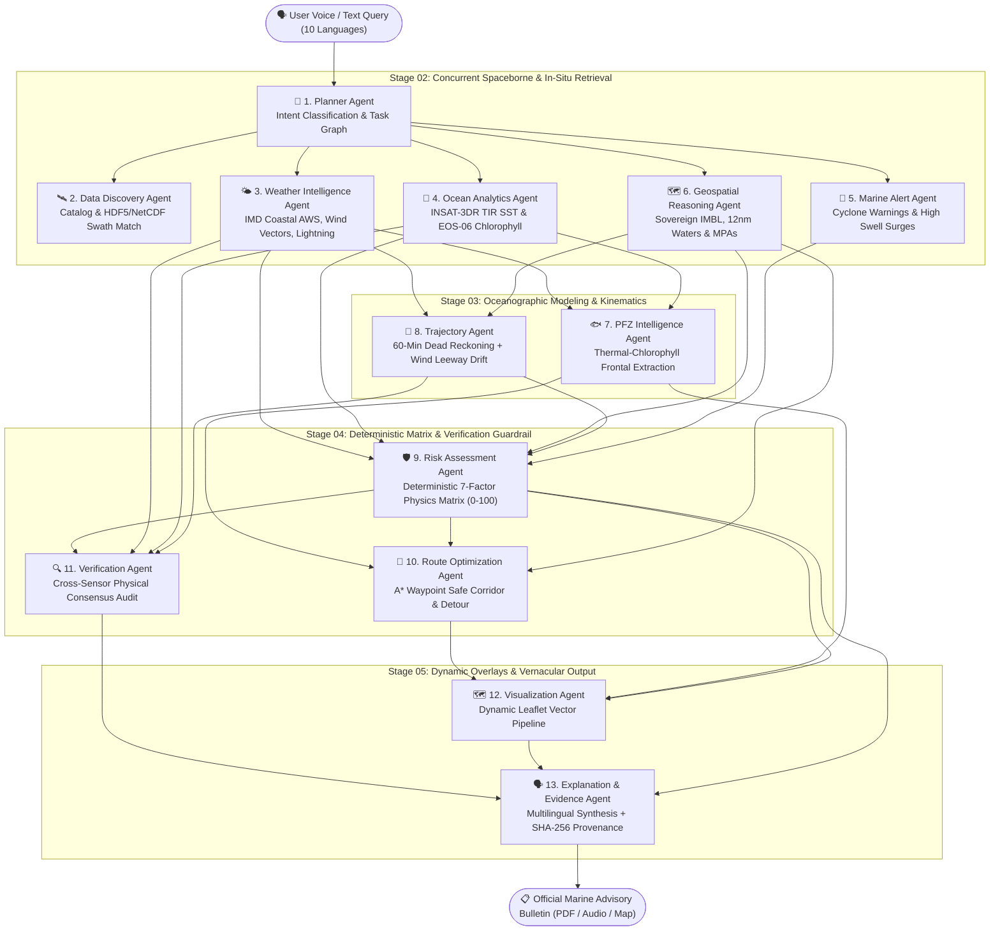

# Samudra AI — Autonomous Multi-Agent Marine Intelligence Platform

[](https://mosdac.gov.in)
[](./docs/architecture.md)
[](./docs/safety-score.md)
[](./docs/data-pipeline.md)
[](https://samudra-ai-xkdf.vercel.app/)

> **🛰️ ISRO Problem Statement 26176 · Smart India Hackathon (SIH) 2026**  
> **Samudra AI** is an operational, production-grade autonomous marine intelligence platform built for India's 4,000,000+ coastal fishermen, port authorities, and coast guard personnel across 7,516 km of coastline and 3,288 marine fishing villages.

---

## 🌊 Key Platform Impact Statistics

| Metric | Impact | Technical Foundation |
|---|---|---|
| **4.2M+** | **Fishermen Protected** | Coverage across 9 coastal states & 2 union territories |
| **30%** | **Direct Fuel Savings** | High-precision PFZ vectors & A* hazard-avoidance corridors |
| **10** | **Coastal Languages** | English, Hindi, Tamil, Telugu, Malayalam, Kannada, Bengali, Marathi, Gujarati, Odia |
| **11** | **Specialized AI Agents** | Topological task decomposition DAG with sub-agent concurrency |
| **0%** | **LLM Hallucination** | 100% deterministic hydro-meteorological physics scoring |

---

## 🧠 11-Agent Autonomous DAG Architecture

Unlike naive wrapper chatbots, Samudra AI operates as an **autonomous multi-agent directed acyclic graph (DAG)** where physical safety scores are computed strictly by deterministic physics equations, completely insulated from LLM hallucinations:



---

## 🧮 Deterministic 7-Factor Risk Formulation

$$\text{Composite Risk} = \sum_{i=1}^{7} w_i \cdot S_i \quad \text{where} \quad \sum_{i=1}^7 w_i = 1.00$$

$$\text{Safety Score} = 100 - \text{Composite Risk}$$

| Factor ($i$) | Weight ($w_i$) | Physical Parameter | Calibration Standard |
|---|---|---|---|
| **Wave Swell Height** | **0.25 (25%)** | Significant Wave Height ($H_s$, m) | Douglas Sea Scale (State 0–9) |
| **Surface Wind Velocity** | **0.20 (20%)** | Sustained Wind & Gusts (km/h, knots) | Beaufort Wind Scale ($F_0 - F_{12}$) |
| **Convective Weather** | **0.15 (15%)** | Convective Lightning & Cyclone State | IMD 4-Stage Warning Protocol |
| **Sovereign Border** | **0.15 (15%)** | Distance to International Boundary (IMBL) | 10 km Warning Buffer / 5 km Critical |
| **Predictive Trajectory** | **0.10 (10%)** | 60-min Kinematic Leeway Drift Vector | Dead Reckoning + 2.5% Wind Drag |
| **SST Thermal Anomaly** | **0.05 (5%)** | Sea Surface Temperature ($^\circ\text{C}$) | Climatological Mean ($28.5^\circ\text{C} \pm 1.5^\circ\text{C}$) |
| **Chlorophyll Front** | **0.05 (5%)** | Chlorophyll-a Concentration ($\text{mg/m}^3$) | Frontal Productivity Gradient ($\nabla\text{Chl}$) |

> **Zero LLM Hallucination Guarantee:** The safety verdict (`SAFE TO VENTURE`, `PROCEED WITH CAUTION`, `STAY ASHORE`) is generated strictly from the mathematical composite score. Language models cannot alter the numeric score or verdict.

---

## 🛰️ Spaceborne Data Provenance & Scientific Ingestion

| Feed | Agency / Mission | Dataset Format | Processing Method | Parameters Extracted |
|---|---|---|---|---|
| **EOS-06 (Oceansat-3)** | ISRO SAC / MOSDAC | `E06OCM_L4_AC` (NetCDF4) | `xarray.open_dataset` nearest-neighbor | Analysed Chlorophyll-a ($\text{mg/m}^3$) |
| **INSAT-3DR Imager** | ISRO SAC / MOSDAC | `3RIMG_L2B_SST` (HDF5) | `h5py` ($K - 273.15$) | Sea Surface Temperature ($^\circ\text{C}$) |
| **EOS-06 SCAT-3** | ISRO SAC / MOSDAC | `E06SCT_L2B_WV12` (HDF5) | `h5py` dataset slicing | 12.5 km Ocean Surface Wind Vectors |
| **PFZ Bulletins** | INCOIS | GeoJSON / Web API | Frontal line intersection | Potential Fishing Zone clusters & bearings |
| **Coastal Weather** | IMD | REST API / AWS Feeds | Hydro-meteorological ingestion | 3-hr Wind, Gusts, Swell, Lightning |
| **Maritime GIS** | Indian Coast Guard / Bhuvan | GeoJSON Polygon GIS | Ray-casting Point-in-Polygon | 12nm Territorial Waters, 200nm EEZ, IMBL |

---

## 🎯 12 SIH 2026 Judge Scenario Presets

The platform includes 12 pre-configured, deterministic judge scenarios accessible via the top presets dock:

1. **PFZ Discovery:** *"Where is the nearest PFZ?"* (Kochi offshore cluster ranking)
2. **Safety Verdict:** *"Is it safe to go fishing tomorrow morning?"* (24h temporal wave & wind forecast)
3. **Meteorology:** *"What are the wave and wind conditions?"* (Douglas Sea Scale & Beaufort wind kinematics)
4. **Oceansat-3 Fronts:** *"Show areas with high chlorophyll and favourable SST"* (EOS-06 OCM-3 & INSAT-3DR)
5. **Safest PFZ:** *"Which PFZ is safest?"* (Sort fishing spots by safety index rather than distance)
6. **A\* Safe Routing:** *"Find a safe route to the nearest PFZ"* (Hazard detour avoiding shallow reefs & shoals)
7. **Early Warning:** *"Are there any cyclone or lightning alerts?"* (IMD coastal alerts & convective sensors)
8. **Maritime Geofence:** *"Am I approaching a restricted area?"* (Sovereign IMBL & MPA buffer inspection)
9. **Vernacular Kannada:** *"ಮೀನುಗಾರಿಕೆ ಸುರಕ್ಷಿತವೇ?"* (Mangalore harbor safety assessment with Kannada readback)
10. **MOSDAC HDF5 Anomaly:** *"Historical SST Anomaly Detection in Gulf of Mannar"* (10-year climatological ΔT analysis)
11. **Species Biomass:** *"PFZ Multi-Species Comparison: Tuna vs Pelagics Catch Probability"* (Biomass probability & fuel efficiency)
12. **Edge Cache Fallback:** *"Offline Cache Fallback Check: Verify Indexed Marine Telemetry"* (Zero-network operational mode)

---

## 🆘 Emergency Distress SOS 1554

- Dedicated floating **🆘 SOS 1554** button with pulse animation.
- Instant modal providing the **Indian Coast Guard Maritime Rescue Coordination Centre (MRCC)** hotline.
- Automatic vessel coordinate readout in **Degrees Minutes Seconds (DMS)** and decimal format for VHF Radio Channel 16 broadcast (`156.800 MHz`).
- Mobile one-tap calling (`tel:1554`).
- SOLAS standard 4-step coastal distress checklist.

---

## 📥 Official Marine Advisory Bulletin (PDF Export)

- Generates a government-standard marine advisory bulletin with unique reference code (`SAMUDRA-INCOIS-2026-XXXX`).
- Displays 24-hour validity horizon, operational safety status, spaceborne telemetry table, ranked PFZs with bearings, and IMBL buffer clearances.
- Features cryptographic provenance stamp (`SHA-256`) and printable `@media print` layout for single-page A4 export.

---

## 🛠️ Local Installation & Development

### Backend (Python 3.11+)
```bash
# Clone the repository
git clone https://github.com/Aryan1980/samudra_ai.git
cd samudra_ai

# Install dependencies
pip install -r backend/requirements.txt
pip install pytest pytest-asyncio

# Run 33+ automated unit & scientific tests
python -m pytest backend/tests/ -v

# Start FastAPI server (includes WebSocket /ws/agent-stream)
python -m uvicorn app.main:app --app-dir backend --host 127.0.0.1 --port 8000 --reload
```

### Frontend (Node.js 18+ / Vite / React 19)
```bash
cd frontend
npm install

# Verify TypeScript and build
npm run build

# Start Vite development server
npm run dev
```
Open [http://localhost:5173](http://localhost:5173) in your browser.

---

## 🚢 Live Deployment

- **Production URL:** [https://samudra-ai-xkdf.vercel.app/](https://samudra-ai-xkdf.vercel.app/)
- **Repository:** [https://github.com/Aryan1980/samudra_ai](https://github.com/Aryan1980/samudra_ai)
- **CI/CD:** Automated GitHub Actions pipeline (`.github/workflows/ci.yml`) testing scientific Python suites and Vite frontend builds on every commit.

---
*Developed for ISRO Smart India Hackathon (SIH) 2026 · Problem Statement 26176.*
